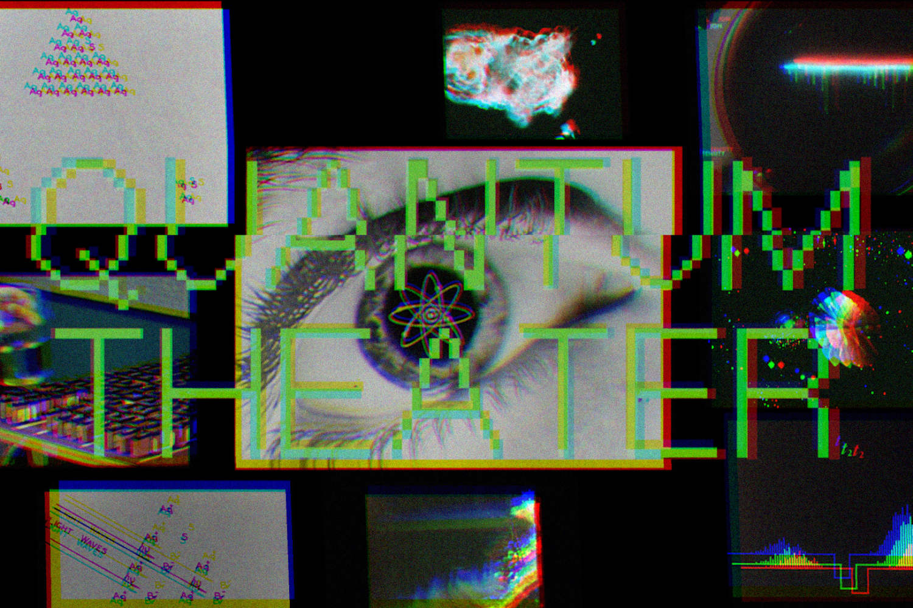
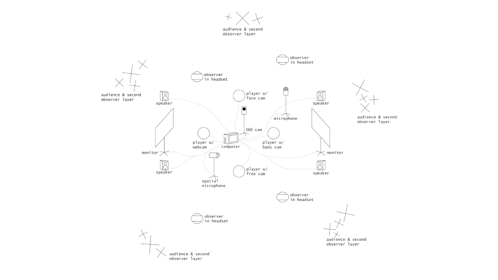

  

# Overview
Quantum Theater takes quantum science as subject and method for immersive theater. Phenomena like entanglement, superposition, coherence, and collapse shape the performance in a post-AI exploration of liveness, variability, and improv. Multiple realities are layered on stage, where the audience as observer-participant plays an active role in cohering singular narratives. 

# Details

Coming in May 2025.

  <iframe 
    src="https://www.youtube.com/embed/ye4SeRKsn8M?si=Eahw-UmiP1hMM1VD" 
    title="YouTube video player" 
    frameborder="0" 
    allow="accelerometer; autoplay; clipboard-write; encrypted-media; gyroscope; picture-in-picture; web-share" 
    referrerpolicy="strict-origin-when-cross-origin" 
    allowfullscreen
    style="width: 100%; height: 100%; object-fit: cover; object-position: center;">
  </iframe>

## Staging

  

# Team
**Ash Smith** - Speculative Devices Lab, Johnny Carson for Emerging Media Arts, University of Nebraska-Lincoln - [asheveryday.com](https://asheveryday.com/) 

**Robert Twomey** - Machine Cohabitation Lab ([cohab-lab.net](https://cohab-lab.net)), UCSD Department of Visual Arts and Arthur C. Clarke Center for Human Imagination  - [roberttwomey.com](https://roberttwomey.com) 

**Reid Brockmeier** - Creative Technologist, Awareness Lab and Speculative Devices Lab at the University of Nebraska-Lincoln 

**Samantha Bendix** - Artist, Designer, and Developer for Immersive Media, Speculative Devices Lab and Edgeworks, University of Nebraska-Lincoln. 

# References

_This project is made possible through support from the Grand Challenge Grant Quantum Approaches Addressing Global Threats (PIs Binek and Hermiller), University of Nebraska-Lincoln_
